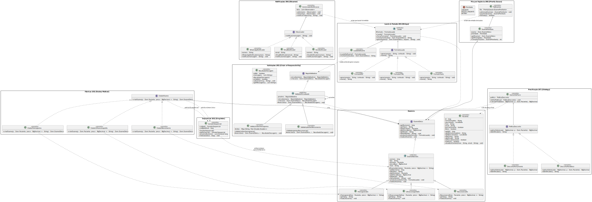

# ST Diagnósticos – Sistema de Gerenciamento de Exames Médicos e Emissão de Laudos

## Visão Geral

Este projeto simula o sistema de gestão de exames da empresa fictícia ST Diagnósticos, utilizando padrões de projeto para garantir modularidade, extensibilidade e manutenibilidade. A aplicação realiza geração de laudos, validações por tipo de exame, notificações aos pacientes, aplicação de descontos, priorização e filtragem de exames.

---

## Requisitos do domínio com descrição dos padrões de projeto utilizados

- **R1 – Carregar dados de CSV**  
 *Descrição:* os dados de entidades como Paciente, Medico (solicitante e responsável pelo laudo) serão estruturados previamente em arquivos CSV. Durante a execução, serão lidos e instanciados por métodos auxiliares simulados em Java.

- **R2 – Gerar número sequencial de exames**
  *Padrão Aplicado:* **Singleton** 
  *Descrição:* uso de um GeradorSequencial (campos: codigoid e codigoidAtual). Garante instância única responsável por proximoNumero() para todos os exames durante a execução. Evita repetição/colisão de IDs e centraliza o controle do sequencial.

- **R3 – Emitir laudos para diferentes tipos de exames (Hemograma, Ressonância, etc.)**  
  *Padrão Aplicado:* **Factory Method**  
  *Descrição:* As fábricas encapsulam a criação de exames sem expor a lógica ao cliente. Para adicionar um novo tipo (ex.: Tomografia), basta criar uma nova classe concreta do exame e uma fábrica correspondente, sem alterar o código que consome CriadorExame (atende ao OCP). CriadorExame (interface) e fábricas concretas CriadorHemograma, CriadorUltrassonografia, CriadorRessonancia; criam instâncias de ExameClinico (concretos: HemogramaEx, UltrassonografiaEx, RessonanciaEx).

- **R4 – Gerar laudos em diferentes formatos (Texto, HTML, PDF)**  
  *Padrão Aplicado:* **Bridge**  
  *Descrição:* Separa conteúdo do laudo da forma de saída (gerarArquivo), permitindo incluir novos formatos sem alterar as classes de laudo e sem explosão de subclasses. Abstração Laudo (e LaudoDeExame) e implementação de formato FormatoLaudo com concretas FormatoTexto, FormatoHTML, FormatoPDF.

- **R5 – Aplicar regras específicas de validação por tipo de exame**  
  *Padrão Aplicado:* **Chain of Responsibility**  
  *Descrição:* As regras são encadeadas (encadear(prox)), cada uma processa e repassa a próxima. Novas validações podem ser inseridas/removidas/reordenadas sem afetar as demais. RegraValidadora (interface), ValidadorEncadeado (abstrata), validadores concretos ValidaLimitesHemograma e ValidaImplantesRessonancia; resultado em ResultadoChecagem.

- **R6 – Notificar paciente quando o laudo estiver pronto (WhatsApp, Email, etc.)**  
  *Padrão Aplicado:* **Observer**  
  *Descrição:* Após a emissão do laudo, o GerenciadorNotificacao aciona automaticamente todos os observadores cadastrados, permitindo múltiplos canais sem acoplamento à lógica de emissão. Observador (interface), notificadores EmailNotificador, SmsNotificador, WhatsAppNotificador e o GerenciadorNotificacao (mantém lista e chama notificarTodos).

- **R7 – Aplicar descontos com base em idade, convênio e campanhas**  
  *Padrão Aplicado:* **Strategy**  
  *Descrição:* O GestorDePreco seleciona a política adequada em runtime (definirPolitica) e calcula o valor final (calcularFinal) sem mudar a lógica central. Novas políticas podem ser adicionadas facilmente. PoliticaDesconto (interface) com estratégias DescontoPorConvenio e DescontoParaIdoso; GestorDePreco como contexto.

- **R8 – Classificar exames por prioridade (Urgente, Pouco Urgente, Rotina)**  
  *Padrão Aplicado:* **Priority Queue**  
  *Descrição:* Os exames entram na fila com a prioridade definida e proximoExame() sempre retorna o mais urgente primeiro, garantindo ordem de atendimento conforme criticidade clínica. enum Prioridade { URGENTE, POUCO_URGENTE, ROTINA }, classe ExamePrioritario (compõe ExameClinico + Prioridade e define compareTo) e FilaExames (PriorityQueue<ExamePrioritario>).

- **R9 – Simular execução do sistema com todos os recursos integrados**  
 *Descrição:* será desenvolvido um método `main()` responsável por orquestrar todo o fluxo: leitura dos arquivos CSV, criação dos exames via fábrica, validação por estratégia, geração de laudos, aplicação de descontos, definição de prioridades, envio de notificações e aplicação de filtros.

---

## Diagrama de Classes:

---

## Equipe:
- Gabriel Manassés
- Geraldo Neto
- Flávio Henrique
- Sheila Lee

## Informações do Projeto:
- Curso: Sistemas para Internet – IFPB
- Disciplina: Padrões de Projeto de Software
- Professor: Alex Sandro da Cunha Rêgo

